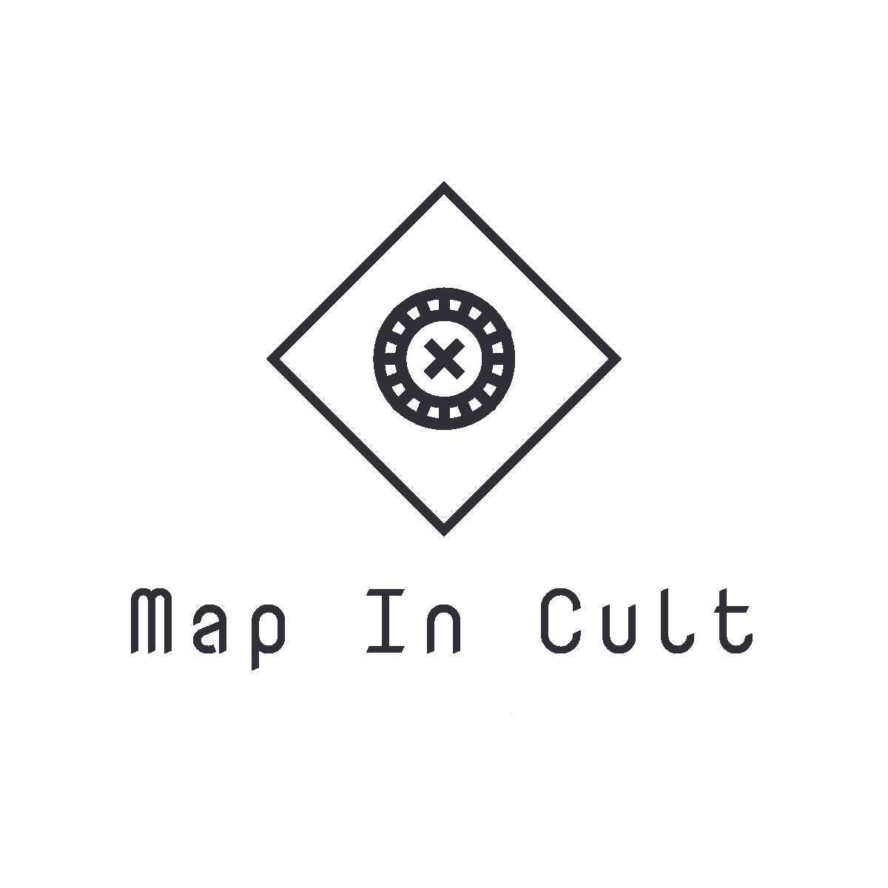
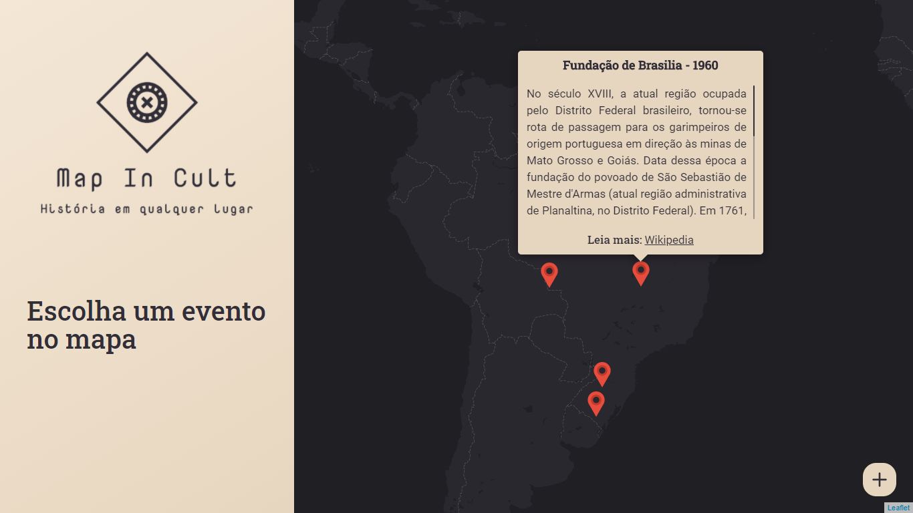

<h1 align="center">
  
<h1>

  <a href="#-projeto">Projeto</a>&nbsp;&nbsp;&nbsp;|&nbsp;&nbsp;&nbsp;
  <a href="#-tecnologias">Tecnologias</a>&nbsp;&nbsp;&nbsp;|&nbsp;&nbsp;&nbsp;
  <a href="#to-do">To-Do</a>

  

## 🖥 Projeto

Map In Cult é uma Single-page application que visa agregar informação e disponibilizar um mapa contendo a posição de onde diversos eventos históricos ocorreram. Ao selecionar um evento qualquer, é apresentado o nome do evento, o ano em que ocorreu, um breve resumo de seus acontecimento e um link para uma página com mais informações. Também é possível adicionar novos eventos dinamicamente.

## ⚙ Tecnologias

O presente projeto foi desenvolvido com o uso das seguintes tecnologias:

- [Node.js](https://nodejs.org/en/)
- [React.js](https://reactjs.org)
- [TypeScript](https://www.typescriptlang.org/)
- [PostgreSQL](https://www.postgresql.org/)
- [React Leaflet](https://react-leaflet.js.org/)
- [Mapbox](https://docs.mapbox.com/) 👈 Você precisará ter uma conta para gerar um access token

## 🛠 To-Do

Funcionalidades que podem ser adicionadas para melhorar a aplicação:

- Sistema para pesquisar eventos pelo nome;
- Adicionar um mini-mapa para selecionar a latitude e longitude quando for cadastrar um novo evento;
- Opção para deletar eventos;
- Opção para modificar eventsource;
- Versão mobile;
